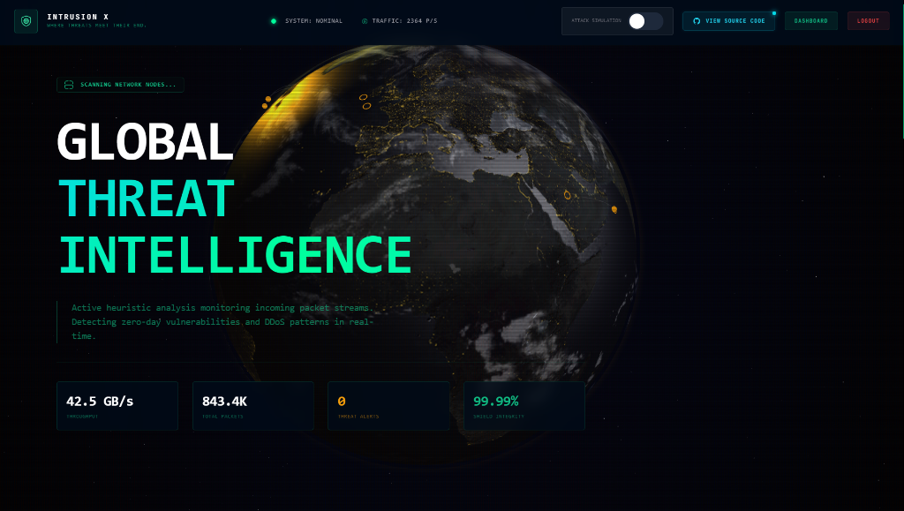

# 🚀 INTRUSION X — Network Intrusion Detection System (SOC Dashboard)

> **“Where Threats Meet Their End.”**

INTRUSION X is a **cybersecurity-focused Network Intrusion Detection System (NIDS)** with a visually immersive **Security Operations Center (SOC) dashboard**. It combines real-time monitoring, anomaly detection, and modern UI/UX to simulate a production-grade cyber defense system.

---

## 📸 Preview

### 🔥 Landing Page



> ⚠️ Replace the path above with your actual screenshot path (e.g., `assets/landing.png` or GitHub image URL)

---

## 🧠 Features

* 🌍 **3D Interactive Landing Page** (Three.js + GSAP)
* 📊 **Real-time SOC Dashboard**
* 🚨 **Threat Detection & Alerts System**
* 📡 **Live Network Traffic Monitoring**
* 📈 **Interactive Charts (Chart.js)**
* 🔐 **Secure Authentication System**
* 🎨 **Dark Cyber UI (Glassmorphism + Neon Theme)**
* ⚡ **Modular & Scalable Django Backend**

---

## 🏗️ Tech Stack

* **Backend:** Django (Python)
* **Database:** SQLite3
* **Frontend:** HTML, TailwindCSS, Custom CSS
* **Animations:** Three.js, GSAP
* **Charts:** Chart.js
* **Scripting:** Vanilla JavaScript

---

## 📁 Project Structure

```
NIDS_BACKEND/
│
├── dashboard/        # SOC dashboard logic and views
├── users/            # Authentication and user management
├── detection/        # Network logs & anomaly detection
├── static/           # CSS, JS, animations
├── templates/        # HTML templates
└── nids_project/     # Django settings & routing
```

---

## ⚙️ Setup Instructions

### 1️⃣ Clone Repository

```
git clone https://github.com/your-username/intrusionx.git
cd intrusionx
```

### 2️⃣ Install Dependencies

```
pip install django
```

*(or)*

```
pip install -r requirements.txt
```

---

### 3️⃣ Run Migrations

```
python manage.py makemigrations
python manage.py migrate
```

---

### 4️⃣ Create Admin User

```
python manage.py createsuperuser
```

---

### 5️⃣ Start Server

```
python manage.py runserver
```

🌐 Open: `http://127.0.0.1:8000/`

---

## 🔐 Access Flow

```
Landing Page → Login → SOC Dashboard → Detection Engine → Alerts & Analytics
```

---

## 🛠️ Utility Scripts

```
# System diagnostics
python ATHEX_SOC.py

# Auto migrations
python run_migrations.py

# Project setup/reset helper
python debesh_help.py
```

---

## 🚀 Production Setup

```
python manage.py collectstatic
```

### Recommended Improvements:

* PostgreSQL / MySQL for production DB
* Redis + Celery for background tasks
* Docker containerization
* Nginx + Gunicorn deployment

---

## 🌟 Future Enhancements

* 🔍 Machine Learning-based anomaly detection (LOF, Isolation Forest)
* 🌐 GeoIP attack visualization
* 📡 Real-time packet capture integration
* 🔔 Email/SMS alert system
* 👥 Role-based access control (RBAC)

---

## 🤝 Contributing

Pull requests are welcome. For major changes, please open an issue first.

---

## 📜 License

This project is licensed under the MIT License.

---

## 💻 Source Code

👉 https://github.com/your-repo-link

---

## 👨‍💻 Author

**Debesh Nayak**
Cybersecurity Enthusiast | Developer | SOC Explorer

---

🔥 *INTRUSION X — Defending Networks, Detecting Threats, Delivering Intelligence.*
